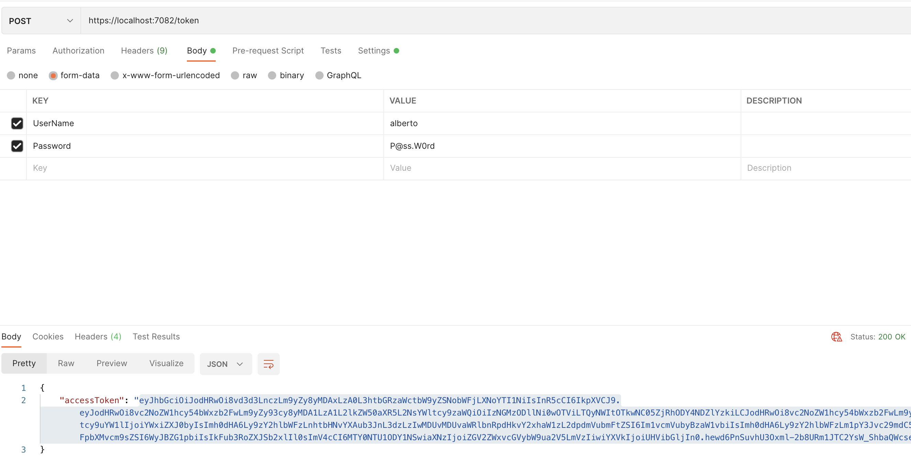
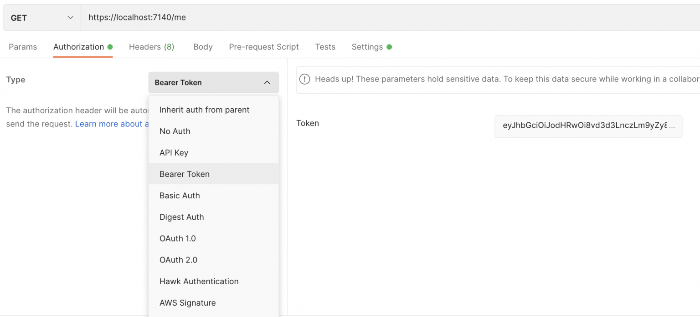

# ASP.NET Core 6 API web & JSON Web Token
Seguridad en servicios Web API de .NET Core usando JSON Web Tokens.

Solución con APIs web ASP.NET Core y características de los JSON Web Tokens, su composición y su implementación utilizando:

* ASP.NET Core 6 (API web controllers & Minimal API)
* ASP.NET Core Identity.
* Entity Framework Core
* JSON Web Token

## Qué es JSON Web Tokens
JSON Web Token (JWT) es un estándar abierto basado en JSON para crear un token que sirva para enviar datos entre aplicaciones o servicios y garantizar que sean válidos y seguros.

El uso de los JWT sirven para manejar la autenticación en aplicaciones móviles o web. De este modo cuando el usuario se quiere autenticar envía sus datos de inicio del sesión al servidor, este genera el JWT y se lo manda a la aplicación cliente, luego en cada petición el cliente envía este token que el servidor usa para verificar que el usuario este correctamente autenticado y permitiendo al usuario acceder a rutas, servicios o recursos que solo están permitidos con su debido token. Este token se usa como método de autenticación y autorización por parte de la aplicación cliente frente al servidor que aloja el recurso.

## Composición JSON Web Tokens
Un JWT está separado por puntos (`HEADER.PAYLOAD.SIGNATURE`) en tres partes, las cuales son:
* **Header**: el tipo de token y el algoritmo usado para en la firma:
```json
{
  "alg": "HS256",
  "typ": "JWT"
}
```
* **Payload**: contiene la información real que se transmitirá a la aplicación. Aquí se definen algunos estándares que determinan qué datos se transmiten y cómo. La información se proporciona como pares key/value (clave-valor); las claves se denominan claims en JWT. No incluir datos sensibles sin cifrar en los claims. Hay 3 tipos de Claims:

    - **Claims registrados**: claims predefinidos que no son obligatorios. Figuran en el IANA JSON Web Token Claim Register y cuyo propósito se establece en un estándar. Como iss (emisor), exp (tiempo de expiración), sub (razón), aud (destinatarios), entre otros.
    - **Claims públicos**: pueden definirse a voluntad, ya que no están sujetos a restricciones. Para que no se produzcan conflictos en la semántica de las claves, es necesario registrar los claims públicamente en el JSON Web Token Claim Register de la IANA o asignarles nombres que no puedan coincidir.
    - **Claims privados**: están destinados a los datos que intercambiamos especialmente con nuestras propias aplicaciones. Si bien los claims públicos contienen información como nombre o correo electrónico, los claims privados son más concretos. Por ejemplo, suelen incluir datos como identificación de usuario o nombre de departamento. Al nombrarlos, es importante asegurarse de que no vayan a entrar en conflicto con ningún claim registrado o público.
```json
{
  "sub": "1234567890",
  "name": "John Doe",
  "iat": 1516239022
}
```
* **Signature**: La firma de un JSON Web Token se crea utilizando la codificación Base64 del header y del payload, así como el método de firma o cifrado especificado. Para que la firma sea eficaz, es necesario utilizar una clave secreta que solo conozca la aplicación original. Por un lado, la firma verifica que el mensaje no se ha modificado por el camino. Por otro, si el token está firmado con una clave privada, también garantiza que el remitente del JWT sea el correcto.
```C#
// Ejemplo 1:
HMACSHA256(
  base64UrlEncode(header) + "." +
  base64UrlEncode(payload),
  your-256-bit-secret
)

// Ejemplo 2:
key =  'secret'
unsignedToken = base64Encode(header) + '.' + base64Encode(payload)
signature = SHA256(key, unsignedToken)
token = unsignedToken + '.' + signature

// Resultado JWT (HEADER.PAYLOAD.SIGNATURE):
eyJhbGciOiJIUzI1NiIsInR5cCI6IkpXVCJ9
.eyJzdWIiOiIxMjM0NTY3ODkwIiwibmFtZSI6IkpvaG4gRG9lIiwiaWF0IjoxNTE2MjM5MDIyfQ
.SflKxwRJSMeKKF2QT4fwpMeJf36POk6yJV_adQssw5c
```

## Buenas prácticas usando JSON Web Tokens
Al generar tokens:
* Emitir siempre tokens firmados
* Usar algoritmos criptográficos fuertes
* Poner fecha de expiración e identificador único
* Dar valor a los emisor (issuer) y destinatarios (audience)
* No incluir datos sensibles sin cifrar en los claims

Al validar:
* No aceptar tokens sin firma
* Validar claims de cabecera
* Validar siempre emisor y destinatarios
* Almacenar las claves de firma por emisor y algoritmo

## Implementando JSON Web Tokens
1. Configuración de servicio
```C#
builder.Services
    .AddHttpContextAccessor()
    .AddAuthorization()
    .AddAuthentication(JwtBearerDefaults.AuthenticationScheme)
    .AddJwtBearer(options =>
    {
        options.TokenValidationParameters = new TokenValidationParameters
        {
            ValidateIssuer = true,
            ValidateAudience = true,
            ValidateLifetime = true,
            ValidateIssuerSigningKey = true,
            ValidIssuer = builder.Configuration["JwtSettings:Issuer"],
            ValidAudience = builder.Configuration["JwtSettings:Audience"],
            IssuerSigningKey = new SymmetricSecurityKey(Encoding.UTF8.GetBytes(builder.Configuration["JwtSettings:Key"]))
        };
    });
```

2. Código para generar el JWT:
```C#
private async Task<string> GetJwt(User user)
{
    var roles = await _userManager.GetRolesAsync(user);
    var claims = new List<Claim>
    {
        new Claim(ClaimTypes.Sid, user.Id),
        new Claim(ClaimTypes.Name, user.UserName),
        new Claim(ClaimTypes.GivenName, $"{user.FirstName} {user.LastName}")
    };

    foreach (var role in roles)
    {
        claims.Add(new Claim(ClaimTypes.Role, role));
    }

    var securityKey = new SymmetricSecurityKey(Encoding.UTF8.GetBytes(_configuration["JwtSettings:Key"]));
    var credentials = new SigningCredentials(securityKey, SecurityAlgorithms.HmacSha256Signature);
    var tokenDescriptor = new JwtSecurityToken(
        issuer: _configuration["JwtSettings:Issuer"],
        audience: _configuration["JwtSettings:Audience"],
        claims: claims,
        expires: DateTime.Now.AddMinutes(720),
        signingCredentials: credentials);

    var jwt = new JwtSecurityTokenHandler().WriteToken(tokenDescriptor);

    return jwt;
}
```

3. API
```C#
[HttpGet]
[Authorize]
public async Task<ActionResult> Get()
{
    var user = _contextAccessor?.HttpContext?.User;

    return Ok(new
    {
        Claims = user?.Claims.Select(s => new
        {
            s.Type,
            s.Value
        }).ToList(),
        user?.Identity?.Name,
        user?.Identity?.IsAuthenticated,
        user?.Identity?.AuthenticationType
    });
}

[HttpPost]
public async Task<ActionResult> Post([FromForm] AuthenticateRequest request)
{
    var user = await _userManager.FindByNameAsync(request.UserName);

    if (user is null || !await _userManager.CheckPasswordAsync(user, request.Password))
    {
        return Forbid();
    }

    return Ok(new
    {
        AccessToken = await GetJwt(user)
    });
}
```
## Probando
1. Obtenemos token llamando a método `post` utilizando Postman (user: Alberto pass: P@ss.W0rd).



3. Para hacer pruebas con el token obtenido llamamos a método `get`. Hay que añadir `Bearer token` en la pestaña *Authorization*



## Enlaces de interés
Para jugar con los JWT [jwt.io](https://jwt.io/) permite decodificar, verificar y generar...

[Tokens](https://auth0.com/docs/secure/tokens)
